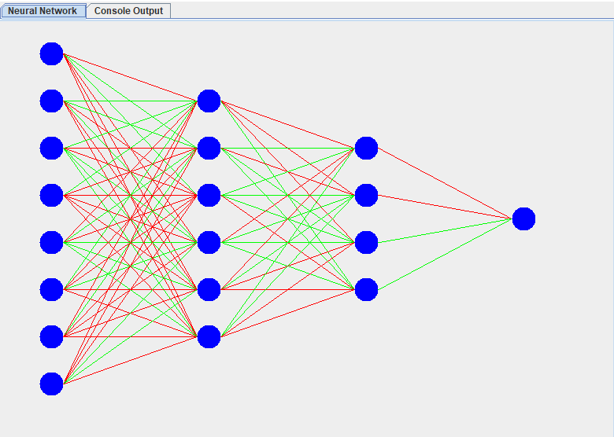
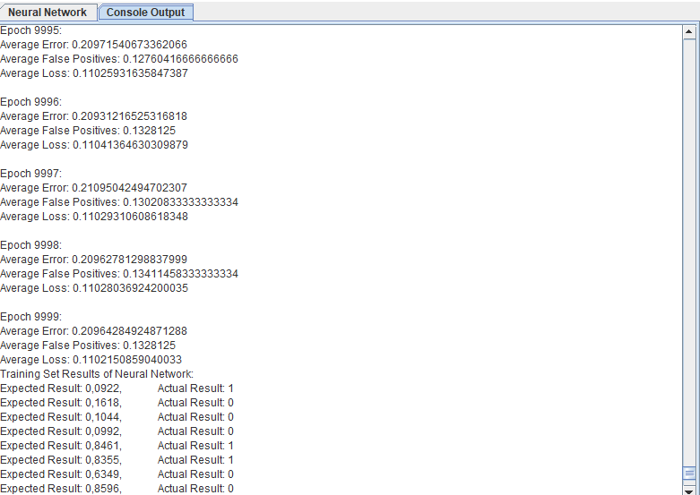

# Neural Network

- [Description](#description)
- [Data Set](#data-set)

## Description
This was a project for my Artificial Intelligence class. The goal of this project was to create a neural network from scratch.
This is a simple neural network that uses the backpropagation algorithm to train itself. 
You can create a neural network with any number of layers and neurons per layer.
The network can be trained with any number of epochs and learning rate.
The Program also creates a graph of the neural network with all its layers and neurons.
It also shows the error of the network over the epochs, and it shows the final result for
each training data set at the end of the training.

## Data Set
The data set used for this project is the Diabetes Database form kaggle.com.
- https://www.kaggle.com/datasets/mathchi/diabetes-data-set?select=diabetes.csv

But you can also use any other data set you want. Just make sure that the data is in a csv file.
Or you can create an array with the data.
